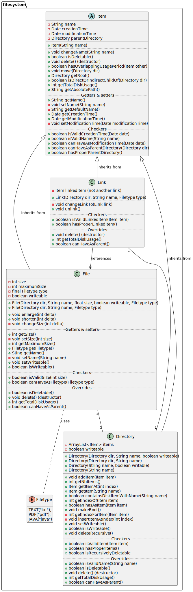

# Practicum 2

Objectgericht Programmeren - KU Leuven Kulak - 2023-2024  
_Vincent Van Schependom - Flor De Meulemeester - Arne Claerhout_

## Klassendiagram

Om de UML aan te passen en te renderen moet je in je IntelliJ de _PlantUML Integration_ plugin installeren.

